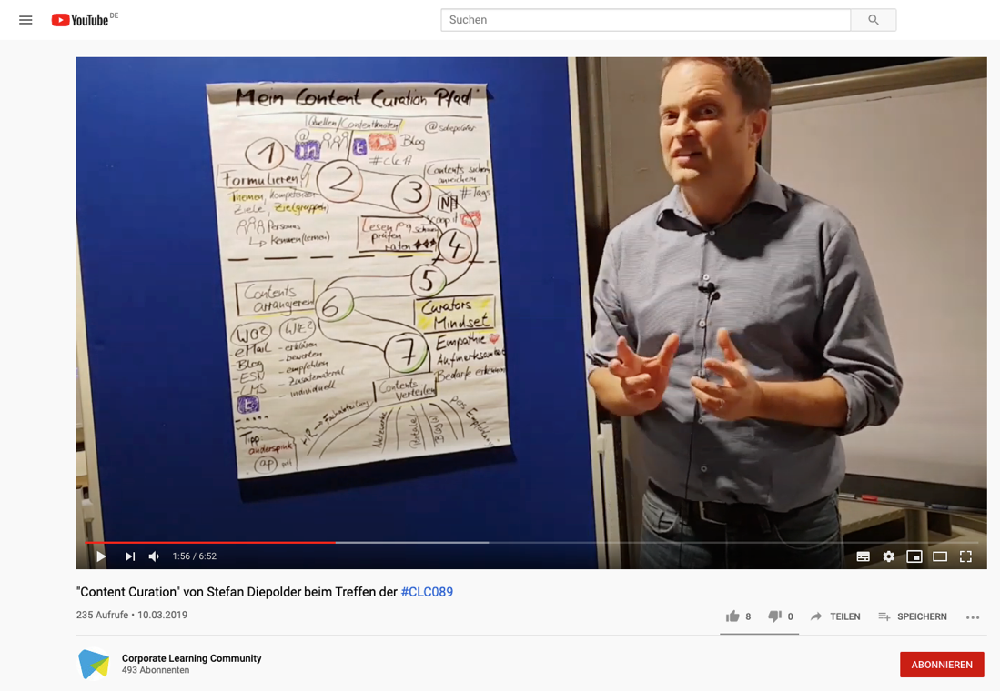

**Content Curation lernOS Circle Guide**

***Ein Leitfaden, wie Ihr relevante Inhalte finden, sinnhaft aufbereiten und teilen könnt***

Du hast keine Ahnung, was Content Curation (oder auch "Kuratierung digitaler Inhalte" genannt) ist und würdest Dir gerne ein Bild davon machen?

Content Curation hilft Dir, wertvolle Informationen über Themen mit Hilfe von Inhalten und Experten zusammenzustellen, ohne das Rad dabei neu erfinden zu müssen. Du lernst Methoden, Formen und Ansätze kennen, wie Du über den Tellerrand Deines Themas schauen und Dein entstehendes Wissen mit anderen teilen kannst.

Wenn Du Dich über diesen lernOS Circle Guide mit Content Curation beschäftigst, wirst Du die Wirkmechanismen und Unterschiede von maschinellen Filtern (über Algorithmen) und menschlichen Filtern verstehen. Aber du lernst auch, Kuratieren für dich und dein Leben
einzusetzen: um offener und sichtbarer zu arbeiten und zu lernen, mit
der Flut an verfügbarem Wissen klar zu kommen, anderen zu helfen, Zeit
zu sparen und Dinge zu verstehen. Ganz nebenbei erarbeitest Du Dir dabei
Reputation und Expertise, innerhalb Deiner Organisation oder in Deinem
Netzwerk. Du wirst lernen, dass auf Vertrauen basierende Netzwerke der
Schlüssel sind, um in unserer komplexen Welt klar zu kommen und um
schnell und effektiv zu lernen und innovativ zu sein.

 

Wenn Du mehr Details erfahren möchtest, um zu entscheiden, ob der
Content Curation Leitfaden richtig für Dich ist, hör doch in Stefan\`s
Podcast zu Content Curation rein -- das hilft Dir bestimmt, ein paar
Einblicke in das Thema zu gewinnen und Dich zu entscheiden, ob Du Dich
die nächsten 13 Wochen intensiver mit Content Curation beschäftigen
möchtest.

[Der Podcast](https://podcast.opensap.info/education-newscast/2020/02/10/education-newscast-073-learntec-content-kuratierung-mit-stefan-diepolder/) mit Christoph Haffner und Thomas Jenewein vom
SAP Education Newscast zu Content Curation im Rahmen der Learntec Messe
2020 - die Episode dauert ca. 52 Minuten -
(abgerufen 13.10.2020)

 

**Grundlagen**

Wenn Du überlegst, ob Du diesen Circle durchführen möchtest, dann schau
Dir am besten einmal die nachfolgenden Grundlagen an, die wir für Dich
zusammengestellt haben.

 

- **Was ist Kuratieren?**

- **Wie kann man kuratieren definieren?**

- **Warum sollte man kuratieren?**

- **Was zeichnet Kurator\*innen aus?**

- **Wie funktioniert Kuratieren?**

 

 

**Was ist Kuratieren?**
Einen ersten Einblick bekommst Du über das Video, das Stefan im Rahmen
eines Meetups der Colearn Community München #clc089 aufgenommen hat:\
["Content Curation" von Stefan Diepolder beim Treffen der
https://youtu.be/rn_AQuUxxIk

 

 

 

**Wie kann man kuratieren definieren?**

 Herkunft des Wortes "kuratieren"
[im Langenscheidt Lexikon], https://de.langenscheidt.com/latein-deutsch/curare, abgerufen am
16.06.2020)

Lateinisch "curare" bedeutet u.a.

\...sich kümmern\...

\...sorgen\...

\...sich die Mühe nehmen\...

\...Lust haben\...

Es gibt keine allgemeingültige Definition für Content Curation, aber für
uns definiert diese kurze Zusammenfassung, angelehnt an Robin Good, sehr
gut, um was es dabei geht:

 

> **"Content Curation ist die Kunst, digitale Informationsbausteine und
> Artefakte zu einem bestimmten Thema für ein spezielles Publikumsinteresse zu finden, filtern, organisieren und Wert
> hinzuzufügen und öffentlich zugänglich zu machen."**

Robin Good: [What is Content Curation?](https://medium.com/content-curation-official-guide/what-is-content-curation-84212256e84)
(abgerufen am 16.06.2020)

>  

Kuratieren ist nicht nur eine Idee von ein paar internetaffinen Freaks.
Auch wenn sie oft nicht so benannt werden, gehören die Fähigkeiten von
Kurator\*innen zu den Kernkompetenzen des 21. Jahrhunderts, wie sie z.B.
auch die [Mozilla
Foundation](https://foundation.mozilla.org/en/initiatives/web-literacy/)
herausgearbeitet hat.

 

Teilkompetenzen des Kuratierens wie share, compose, remix, evaluate,
synthesize, search, connect, contribute gehören zu den 21st Century
Skills, die von der Mozilla Foundation im Bereich Web Literacy propagiert werden. Wenn Du die Seiten aufrufst, kannst Du kuratierte Lernpfade zu den einzelnen Kompetenzen durchlaufen. 

Abbildung: <https://foundation.mozilla.org/en/initiatives/web-literacy/>
(CC BY 4.0)

 

**Warum sollten man kuratieren?**

Unser Problem heute ist nicht mehr wie früher der Mangel an Information,
sondern das Fehlen von verlässlichen und effizienten Filtern. Professor
Clay Shirky bringt das sehr deutlich zum Ausdruck.

***"It\`s not information overload. It\`s filter failure."***

Quelle: Clay Shirky. AZQuotes.com, [Wind and Fly LTD], 2020.
https://www.azquotes.com/quote/409865, abgerufen am 18.06.2020.  

Er erklärt den [Information Overload](https://youtu.be/XE38jpFOiv8) in 3
Minuten auf Youtube.

Die Welt, in der wir heute leben, ist von Überfluss gekennzeichnet. Um
mit dem Überfluss klar zu kommen, sind effektive Filter notwendig. Egal
wohin wir sehen, überall werden uns die ersten Entscheidungen
abgenommen, ob wir das wollen oder nicht. Unsere Google Startseite, der
Zugang zur größten Bibliothek der Welt, kennt und merkt sich unsere
Vorlieben und unsere Suchhistorie haarklein -- und schlägt uns durch
Algorithmen optimiert und gefiltert vor, was uns auf unsere Suche am
meisten interessieren sollte.

Wer etwas tiefer einsteigen möchte - das [Video "Beware of the Online
Filter Bubbles"](https://youtu.be/B8ofWFx525s) von Eli Pariser
beschreibt, wie dieser Mechanismus funktioniert (09:05 Minuten)

Wir gehen in einen Supermarkt -- und finden dort die Produkte auf
Augenhöhe, die wir aus Sicht der Supermarktbesitzer kaufen sollten --
und nicht die Produkte, die wir uns eigentlich wünschen wie z.B.
besonders preisgünstige oder nachhaltige, in der Region produzierte
Produkte. Und, und, und\.... Machen wir uns bewusst - wir leben in einer
Welt, die von Überfluss geprägt und für uns gefiltert und kuratiert
wird - und in der bereits viele Entscheidungen und Möglichkeiten von
technischen Systemen oder Menschen vorweggenommen werden.

Die Musik ist hier ein gutes Beispiel, ganz besonders auch für die
Vielfalt und den Überfluss in unserer heutigen Welt: Noch im 17.
Jahrhundert war Musik etwas ganz Besonderes. Sie konnte nur live
genossen werden und Zugang hatten nur sehr wenige reiche und berühmte
Menschen. Ab dem 19. Jahrhundert wurden dann technische Geräte erfunden,
mit denen Musik wiederabspielbar gemacht wurde, von den ersten
Grammophonen, Plattenspieler, Kassetten- und CD-Player bis hin zur
Erfindung des mp3-Formats und damit der Digitalisierung der Musik.
Inzwischen kann jeder seine persönliche Musik auf dem Smartphone immer
und überall bei sich haben, oft aggregiert von mächtigen Portalen wie
YouTube, Spotify oder iTunes. Wir finden alle möglichen Musikstile aus
jedem Winkel der Welt und ganz schnell sind wir mit der Fülle der
Möglichkeiten überfordert. Um dem zu begegnen, setzen die Musikportale
von Algorithmen errechnete Empfehlungen ein, ermöglichen den Austausch
und Empfehlungen unter Freunden stellen zum Beispiel auch eigene,
gefilterte Angebote und Playlisten bereit.

 

Und wenn es um Wissen, Informationen und Inhalte geht, ist es noch
extremer, denn Wissen wächst exponentiell. Wie die Abbildung unten
zeigt, verdoppelte sich das Wissen im Jahr 2017 alle 13 Monate, Tendenz
in Richtung "wesentlich schneller". Dazu tragen zum Beispiel auch
einfache Systeme und Geräte, die für jedermann leicht und schnell zu
nutzen und über Portale und soziale Medien blitzschnell und vielfach
geteilt werden können, bei. Dabei einen guten Überblick zu behalten, die
Spreu vom Weizen trennen zu können, ist wichtiger denn je.

 

Visualisierung von Katrin Mäntele
[\@kleinerw4hnsinn](https://twitter.com/kleinerw4hnsinn) (CC BY)

 

Quelle: Knowledge Doubling Curve, aus:
<https://www.valamis.com/blog/why-do-we-spend-all-that-time-searching-for-information-at-work>,
abgerufen am 17.06.2020

 

Wir sind also stark auf Kuratierung angewiesen und vor allem in der
digitalen Welt umgibt und beeinflusst sie uns ständig, oft auch ohne
dass wir dies bewusst wahrnehmen. Deswegen finden wir es wichtig, sich
mit Kuratierung und ihren Mechanismen auseinanderzusetzen.

**Was zeichnet Kurator\*innen aus?**

Kurator\*innen erschaffen und gestalten einen Raum, arrangieren die von
ihnen ausgesuchten und gefilterten Artefakte und geben ihnen dadurch
einen neuen, individuellen Wert. Wie z.B. ein\*e Kurator\*in einer
Kunstausstellung. Ein\*e Kurator\*in für Content lernt selbst
unglaublich schnell und effizient, indem er\*sie sich selbst intensiv
mit Themen auseinandersetzt, eintaucht, filtert und ordnet, selbst
kuratiert. Besonders der Prozess des Anreicherns bzw. des Sensemaking,
in dem man sich intensiv mit den gesammelten Inhalten beschäftigt, sie
validiert, hinterfragt und etwas Neues, wie z.B. einen Blogpost, einen
Podcast oder ein Video aus ihnen erschafft, initiiert einen effizienten
und intensiven Lernprozess und hilft, gute und begründete Entscheidungen
treffen zu können.

 

Gute Kurator\*innen kennen ihr Publikum und dessen Bedürfnisse und
Interessen. Sie sind sehr gut vernetzt, sowohl mit ihrer Zielgruppe (dem
sogenannten \"Tribe\") als auch mit Wissensträger\*innen und
Vordenker\*innen, die für \"ihr" Thema relevant sind. Sie denken und
arbeiten ähnlich wie investigative Journalist\*innen, die sich mit viel
Fleiß und Akribie die besten Content Nuggets suchen, filtern und
sammeln. Sie kümmern sich um ihr Publikum, indem sie ihm ihre besten
Quellen bereitstellt und diesen einen persönlichen Wert hinzufügen und
damit ihrem Publikum einen Grund geben, sich mit dem Inhalt oder Thema
zu beschäftigen.

Visualisierung von Katrin Mäntele
[\@kleinerw4hnsinn](https://twitter.com/kleinerw4hnsinn) (CC BY)

 

**Wie funktioniert Kuratieren?**

Content Curation, so wie es heute in vielen Bereichen genutzt wird, ist
aus dem Überangebot an Informationen, die zum Teil schwer einzuschätzen
und in Bezug zu bringen sind, entstanden. Es spiegelt die Notwendigkeit
wider, relevante Informationen zu finden, zu filtern, festzuhalten, auf
Fakten und Wahrheitsgehalt zu prüfen und dann anzureichern und
Anknüpfungspunkte an bestehendes Wissen zu schaffen.

 

Eine mögliche Vorgehensweise für diese Schritte ist ein dreistufiger
Prozess nach Harold Jarche (2014)
(<https://jarche.com/2014/02/the-seek-sense-share-framework/>), der sich

1. mit dem **Suchen bzw. Finden** von Inhalten, Information und

   > Experten befasst,

2. dem **Filtern und Organisieren** und im weiteren, wichtigen Schritt

   > dann **Anreichern** dieser Inhalte mit **Wert und Meinungen**,

3. und schließlich den Möglichkeiten des **Teilens und Austauschens**.

{width="6.33333552055993in"
height="3.5520833333333335in"}Visualisierung von Katrin Mäntele
[\@kleinerw4hnsinn](https://twitter.com/kleinerw4hnsinn) (CC BY)

 *Kompetenz um die Kurator\*innen einzuschätzen (Werte) - Werte sollten
klar sein*

1. **Suchen bzw. Finden**\

   > Es geht darum, interessante und relevante Informationen zu finden
   > und auf dem Laufenden zu bleiben. Unter all dem „Lärm" die
   > wirklich hilfreichen, lesens- und lernenswerten Beiträge vom
   > „Geplapper" zu unterscheiden. Und sich über die Zeit ein Netzwerk
   > von vertrauenswürdigen Quellen und Experten aufzubauen. So dass
   > man nicht nur Informationen sucht, sondern sie auch automatisch
   > über unser Netzwerk ihren Weg zu uns finden. Gute Kuratoren sind
   > immer auch verlässliche Mitglieder in Wissensnetzwerken.\
   >  

2. **Filtern, Organisieren und Anreichern**\

   > Filtern heißt die Spreu vom Weizen trennen, wissen, welchen
   > Quellen und Menschen man vertrauen kann und wie man
   > Wissensbereiche voneinander abgrenzt, um den roten Faden nicht zu
   > verlieren. Im nächsten Schritt muss man für sich eine
   > übersichtliche und zeitsparende Art finden, die Informationen zu
   > speichern, sortieren und schnell auffindbar zu machen.\
   > Dann kann man im wichtigsten Schritt, dem Anreichern von Wert und
   > Nutzen für die Zielgruppe, sinnvoll mit den Inhalten arbeiten und
   > z.B. Zusammenfassungen schreiben, Querverweise herstellen,
   > vergleichen, kritische Fragen stellen usw. Selbst zu kuratieren
   > und aus verschiedenen Bausteinen und Artefakten einen Artikel oder
   > Blogpost zu erstellen, ist eine sehr effektive und wirkungsvolle
   > Methode, selbst zu lernen und Wissen aufzubauen.\
   >  

3. **Teilen & Austauschen**\

   > Hier geht es darum, für sich ein Gespür und eine Praxis zu
   > entwickeln, wie man seine angereicherten Inhalte wann und mit wem
   > teilt, wie man Ideen und Erfahrungen in seinen Netzwerken
   > weitergibt, Feedback einholt, Inspirationen bekommt oder in die
   > Zusammenarbeit mit Kolleg\*innen in der Arbeit geht.

 

**Quellen & weiterführende Links:**

* Zusammenfassung des Meetups zu Content Curation mit Stefan Diepolder:
  <https://colearn.de/clc-muenchen-clc089-content-curation-im-corporate-learning/>
  (abgerufen am 12.04.2020)

* Kuratieren: <https://de.langenscheidt.com/latein-deutsch/curare>,
  abgerufen am 15.04.2020

* Definition Content Curation: Angelehnt an Robin Good [Content Curation
  Official
  Guide](https://medium.com/content-curation-official-guide/what-is-content-curation-84212256e84),
  abgerufen am 13.04.2020

* Mozilla, Web Literacy: <https://learning.mozilla.org/en-US/web-literacy>

* Lesetipp: *\"Curation -- The Power of Selection in a World of Excess\"*
  von Michael Bhaskar. Verbindet Industriegeschichte mit Kuratierung und
  zeigt in vielen anschaulichen Beispielen, in welchen Lebensbereichen wir
  schon mit Kuratierung vertraut sind.

* Digitalisierung der Musikindustrie:
  <https://blog.wiwo.de/look-at-it/2018/10/09/digitalisierung-der-musikindustrie-turnaround-durch-streaming-nach-schwund-um-zwei-drittel/>,
  abgerufen 16.04.2020

* Knowledge Doubling Curve by Buckminster Fuller
  <https://www.valamis.com/blog/why-do-we-spend-all-that-time-searching-for-information-at-work>,
  abgerufen am 18.04.2020

* Good, Robin (2018): What is Content Curation URL:
  <https://medium.com/content-curation-official-guide/what-is-content-curation-84212256e84>,
  abgerufen am 23.03.2020

* Shirky, Clay (2011): It\`s not Information Overload, it\`s Filter
  Failure URL: <https://www.azquotes.com/quote/409865>, abgerufen am
  18.04.2020

* Jarche, Herold (2014): The Seek Sense Share Framework URL:
  <https://jarche.com/2014/02/the-seek-sense-share-framework/>, abgerufen
  am 15.04.2020)

* Janne Hietala, Jens Harju, Samu Kuosmanen (2019): Knowledge Doubling
  Curve by Buckminster Fuller URL:
  <https://www.valamis.com/blog/why-do-we-spend-all-that-time-searching-for-information-at-work>,
  abgerufen am 18.04.2020

* "PKM -- A set of processes, individually constructed, to help each of us
  make sense of our world and work mor effectively

* Zitat aus dem YouTube Video [Personal Knowledge Management Workshop
  Intro 2013](https://youtu.be/HQbnoLxgx7I), abgerufen am 18.06.2020
