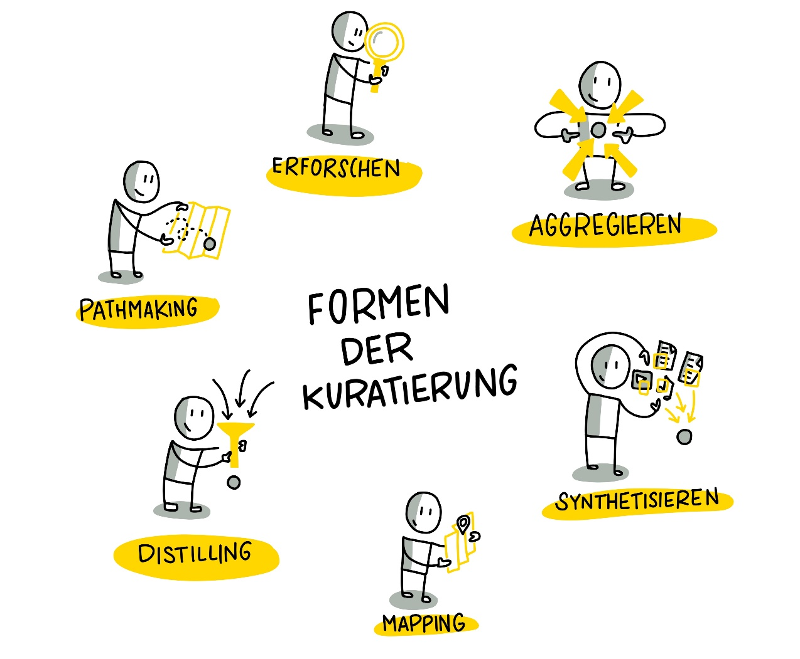
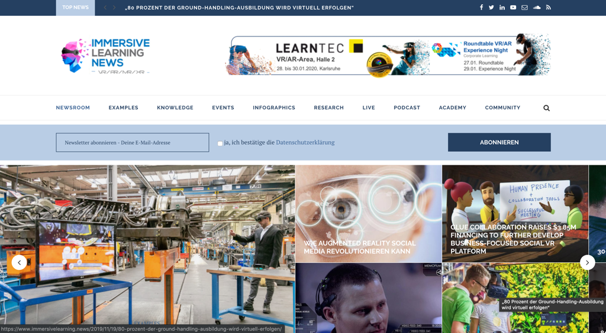

## Woche 8 - Formen der Kuratierung

 Es gibt ganz unterschiedliche Möglichkeiten wie das kuratierte
 Ergebnis dargestellt werden kann ("Sensemaking"). Robin Good hat
 eine umfassende Aufzählung von Ansätzen und Formaten mit vielen
 spannenden Beispielen in seinem Artikel ["Content Curation
 Approaches: Types and
 Formats"](https://medium.com/ccontent-curation-official-guide/content-curation-approaches-types-and-formats-ae2b33fe6a18)
 gesammelt und beschrieben. Diesen Artikel solltest Du Dir auf jeden
 Fall durchlesen, bevor Du Dir überlegst, welches Format Du einsetzen
 möchtest.

 Allen Typen und Formen ist folgendes gemein - ***"finding and organizing
 existing content artifacts to create new insights and shared value"***
 ([Robin
 Good](https://medium.com/content-curation-official-guide/content-curation-approaches-types-and-formats-ae2b33fe6a18%20)).

  

 

Visualisierung von Katrin Mäntele
[@kleinerw4hnsinn](https://twitter.com/kleinerw4hnsinn) (CC BY)

 Folgende Formate bzw. Arten der Kuratierung, die auf den Ideen von
 Robin Good basieren, finden wir für einen Lernkontext am
 relevantesten. Wir empfehlen Dir, Formate auszusuchen, mit denen Du
 Dich wohl fühlst (z. B. \"Ich schreibe gerne\" -\ Blog)

  

 **Aggregieren**

 Das Aggregieren von Contents beschreibt die Arbeit, wenn der Kurator
 qualitativ hochwertige Inhalte oder Artefakte sammelt, beschreibt und
 an einem zentralen Ort für seine Zielgruppe bereitstellt. Besonders
 wertvoll sind diese aggregierten Contents, wenn sie von einem
 anerkannten Fachmann, einem so genannten **"Trusted Guide"**,
 bereitgestellt werden.

  

 Ein sehr gutes Beispiel ist [https://www.immersivelearning.news/](https://www.immersivelearning.news/) von
 Torsten Fell - ein Portal, das alle relevanten Informationen zu Lernen
 mit Augmented Reality, Virtual Reality und Mixed Reality bereitstellt
 und auf jeden Fall ein sehr guter Ausgangspunkt für einen "Deep
 Dive" in das Thema ist.

  

 

 Screenshot Landingpage Portal [Immersive Learning News](https://www.immersivelearning.news/) von Torsten
 Fell

  

 **Profitipp**: Wenn Du nach einem bestimmten Thema suchst und eine
 verlässliche Quelle gefunden hast, nutze die Google-Seitensuche, um
 schnell zu der gewünschten Information zu gelangen.
  

 

  

  

 **Verknüpfen**
 Ganz klassisch geht es beim Synthesizing um das Zusammenfassen von
 langen, aufwändigen Medien und Inhalten in kurze, knackige Nuggets,
 die aber die Essenz des Mediums/Inhalts wiedergeben. Auch die Auswahl
 der Medien ist eine Leistung der Kuratoren\*innen.

 Klassische Beispiele sind (bezahlte) Services wie
 [www.getabstract.com](http://www.getabstract.com/) oder
 [www.blinkist.com](http://www.blinkist.com/), die Bücher, Videos und
 Podcasts zusammenfassen und als geschriebenen Text, Audio oder
 Sketchnote präsentieren.

 

 Beispiel: Buchzusammenfassung bei
 [www.blinkist.com](http://www.blinkist.com/)

 Gemeinsam an diesen vielfältigen und inhaltlich tiefen Portalen ist,
 dass der einzelne Content meist sehr gut und akkurat zusammengefasst
 ist, man aber weiterhin nach dem "richtigen" Content suchen muss.
 Welcher Content aber für Dich und Deine Interessen und Bedürfnisse
 interessant sein sollte, können diese Portale kaum aussagen - sie
 agieren hier als Content-Aggregatoren, die zwar eine grobe
 Orientierung durch Themencluster und Empfehlungen per Algorithmus
 geben - echte Empfehlungen oder Orientierung durch Trusted Guides
 bekommt man nicht.

 Einen unserer Lieblingsblogs,
 [www.weiterbildungsblog.de](http://www.weiterbildungsblog.de/), würden
 wir ebenfalls in den Bereich "Synthesizing" einordnen, da Dr. Jochen
 Robes zu jedem Artikel, die er sorgfältig filtert und für seine HR und
 Digital Learning Tribes publiziert, mit einer kurzen persönlichen
 Einschätzung oder Zusammenfassung Wert hinzufügt und uns Leser\*innen
 einen Hinweis gibt, ob wir uns tiefer mit den von ihm kuratierten
 Inhalten beschäftigen sollten. Er nimmt uns auch viel Arbeit ab, indem
 er weltweit Trends und Ideen scoutet, verschlagwortet und einmal
 wöchentlich in seinem Newsletter verteilt.

 ![CLC München #CLC089: Content Curation im Corporate Learning By
 Jochen Robes, 20. März2019 Das Internet bietet uns eine Fülle von
 Informationen. Doch wie finden wir die, die für uns oder für andere
 relevant sind? Das Stichwort heißt Content Curation, also das
 systematische Auf- finden, Aufbereiten und Veröffentlichen von
 Information. Stefan Diepolder hat darüber in München erzählt. Dabei
 ging es um die Bedeutung des Themas, seine Auswirkungen, den
 nützlichen ro- ten Faden von Harold Jarche („Seek \ Sense \ Share\")
 und die Frage, wie Personalentwickler, Unternehmen und jeder einzelne
 Wissensarbeiter davon profitieren können. Auch wenn das The- ma auf
 keiner Corporate Learning-Agenda ganz oben steht: Es ist fast schon
 überraschend, dass wir noch von keinem Unterneh- men und seiner
 expliziten Content Curation-Strategie gehört haben \... kristinauth,
 Corporate Learning Community, 17. März 2019 Bildquelle: CLC München
 ](./images/image16.png)

 Screenshot:
 [#clc089 Meetup Content Curation](https://weiterbildungsblog.de/blog/2019/03/20/clc-muenchen-clc089-content-curation-im-corporate-learning/)

  

 **Verknüpfen**

 Beim Mapping sammeln und organisieren Kurator\*innen alle wichtigen
 Elemente, die ein spezifisches Gebiet beschreiben und definieren die
 Beziehung zwischen den Komponenten.

 Das Beispiel der [MOOC Plattform
 Coursera](https://www.edukatico.org/de/report/coursera-groesste-globale-mooc-plattform-und-hunderttausende-lernende-aus-deutschland)
 zeigt, dass es auch möglich ist, über 40 Mio. Lerner und über 1000
 Kurse aus über 150 Universitäten zu organisieren. Um eine gute User
 Experience zu ermöglichen müssen die unterschiedlichen Daten mit einer
 sehr guten Struktur abgelegt und intelligent verknüpft sein. Coursera
 gelingt dies aus unserer Sicht: man kann seine Suche sehr gut
 einschränken und hat dabei das Gefühl, dass die Plattform klein, gut
 gepflegt und übersichtlich ist. Das zeugt von einer sehr guten
 Kuratoren\*innenarbeit.

  

 ![Suchen v Was möchten Sie lernen? Niveau Für Unternehmen Entwickler
 Anmelden Kostenlose Teilnahme Suchen \ Persönliche Entwicklung
 Persönliche Entwicklung o Filtern nach: Kompetenzen Stellenbezeichnung
 Sprache v Typ Die beliebtesten Zertifikate Business Too UCI Practical
 Man ement Career Success University of California, Irvine UCI Academic
 English: Writing University of California, Irvine Arizona State
 University TESOL Arizona State University ZERTIFIKAT OBER BE-RUFLICHE
 Learning How to Learn Learning How to Learn: Powerful mental tools to
 help yo\... McMaster University](./images/image17.png)

 [Screenshot Coursera](https://www.coursera.org/browse/personal-development)

  

 **Destillieren**

 Diese Form der Kuratierung sorgt dafür, dass die relevantesten
 Informationen zu einem spezifischen Thema kurz beschrieben und
 vereinfacht in eine Ordnung gebracht werden. Typisch hierfür sind
 "Best-of" Listen, die neben einer Verlinkung einen zusätzlichen Wert
 bereitstellen. Ein gutes Beispiel für Distilling ist die Auflistung
 der [300 besten Lerntools](https://www.toptools4learning.com/) von
 Jane Hart.

 

 **Lernpfade erstellen**
 Lernpfade sind besonders wertvoll, wenn sie nicht so eng wie in
 traditionellen Blended Learning-Umgebungen bereitgestellt werden
 sondern eher eine Art Leitplanke für die eigene, selbstbestimmte
 Entwicklung darstellen.

 Das Gelernte können wir selbst auf unsere Weise in unserer Arbeit
 anwenden - oder auch nicht.

 

 Sehr interessant sind z.B. kommentierte Linklisten von absoluten
 Fachspezialisten, denen wir die notwendige Expertise, Fähigkeiten und
 Glaubwürdigkeit zuschreiben, wie z.B. Christian Müller von
 [www.proagile.de](http://www.proagile.de/).

 Er schafft es, mit seiner "Agile Toolbox" einen Knotenpunkt zum
 Thema "Agile" bereitzustellen, das Beginnern und Profis im Bereich
 Agile gleichermaßen Orientierung gibt und einen Weg aufzeigt, sich mit
 relevanten Themen und Inhalten auseinanderzusetzen. Die Inhalte sind
 deshalb wertvoll, weil sie von ihm, dem Trusted Guide und Experten für
 Agile empfohlen werden. Wir können Christian über Youtube, Twitter
 aber auch in diversen Barcamps und Workshops erleben, wie er laut
 arbeitet (Working out loud) und uns an seinem Wissen und Ideen
 teilhaben lässt.

 

 [Screenshot Agile Toolbox](https://proagile.de/toolbox/)

  

 **Erforschen**
 Hier handelt es sich um eine journalistische Arbeit mit tiefgehender
 Recherche und Analyse, die sich unterschiedlicher Quellen bedient und
 gegensätzliche Meinungen und Sichtweisen zulässt. Ziel ist es, der
 Zielgruppe die Möglichkeit zu geben, sich eine eigene Meinung zu
 bilden und ein tiefes Verständnis für ein spezielles Thema, eine
 Geschichte oder ein Problem zu fördern, indem man Zusammenhänge
 verständlich darstellt und die Möglichkeit zum tieferen Eintauchen in
 Details und unterschiedliche Auffassungen gibt.

 Anschauliche Beispiele für "Erforschen" sind ausführliche Blogposts
 mit vielen Möglichkeiten, sich weiter zu verlinken. Der folgende Post
 zum Beispiel wurde von Stefan für den Blog der Corporate Learning
 Community verfasst. Seine Intention war es, sich selbst intensiv mit
 dem Thema Blockchain auseinander zu setzen. Dabei hat er bereits
 gesammelte Medien, wie die beiden eingebetteten Videos, die für ihn
 relevant waren, mit Texten und Abstracts von Blockchain-Spezialisten
 angereichert. Ihm war es wichtig, einen möglichst niedrigschwelligen
 Einstieg für seine Zielgruppe, HR Spezialisten aus der Corporate
 Learning Community, zu schaffen. Hier ein Beispiel zur Orientierung:

 ![Themen des Corporate Learning Camps: Blockchain - Nutzen HR und
 Corporate Learning die Blockchain zu- künftig für ihre Zwecke? Oder
 ersetzt die Blockchain HR? September 2018 Charlotte Venema \'2
 Kommentare Gedanken zu einer disruptiven Technik, die Schule,
 Corporate Learning und HR auf den Kopf stel- len könnte von Stefan
 Diepolder Was ist die Blockchain? Als erstes ist Blockchain ein
 Buzzword, das mittlerweile viele benutzen, das aber nur wenige einfach
 und verständlich erklären können. Die Blockchain ist u. a. das System,
 das die sichere Transaktion und Aufbewahrung von Bitcoins ermöglicht.
 Doch was ist die Blockchain genau und wie funktioniert sie? Folgendes
 Video von CommonCraft erklärt in einfachen Worten, wie die Blockchain
 grundsätzlich funktioniert. Blockchain Explained b Common:Craft
 ](./images/image19.png)

 [Link zum Blogpost](https://colearn.de/themen-des-corporate-learning-camps-blockchain-nutzen-hr-und-corporate-learning-die-blockchain-zukuenftig-fuer-ihre-zwecke-oder-ersetzt-die/)

  

 Ein weiteres hilfreiches Beispiel eines kuratierten Blogposts von
 Maria Popova - [Blogpost "Fixed vs. Groth: The Two Basic Mindsets
 That Shape Our
 Lives"](https://www.themarginalian.org/2014/01/29/carol-dweck-mindset/)

   

 **Kata 13:**

 Suche aus Deinem Materialpool die interessantesten Inhalte heraus und
 versuche herauszufinden, ob sie einem der Formate zugeordnet werden
 können. Finde heraus und beschreibe in der Gruppe, warum Du das
 gewählte Format als besonders geeignet (oder auch nicht) einschätzt.
 (20 Minuten)

 **Kata 14:**
 Finde DEIN Format heraus. Überlege Dir, was Deine Vorliebe ist, woran
 Du Spaß hast und welches Format Dir im ersten Schritt wenig Aufwand
 bereitet, es zu erstellen. Mal Dir ein Mockup, eine Sketchnote oder
 erstelle eine Mindmap und stell Dir vor, wie Dein kuratiertes Medium
 aussehen könnte. Präsentiere Deine Ideen den anderen
 Circle-Mitgliedern und diskutiert sie gemeinsam. (40 Minuten)

 **Vertiefungs-Kata:**
 Versuche Dein Thema aus mehreren Gesichtspunkten zu betrachten, z.
 B. Pro/Contra. Versuche Deine Hypothese, die Du mit kuratierten
 Inhalten belegen möchtest, in Frage zu stellen (z. B. Content Curation
 ist Zeitverschwendung). Suche dafür das richtige Format und skizziere
 Deine Idee.
