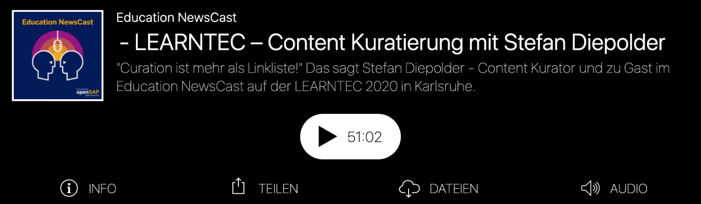
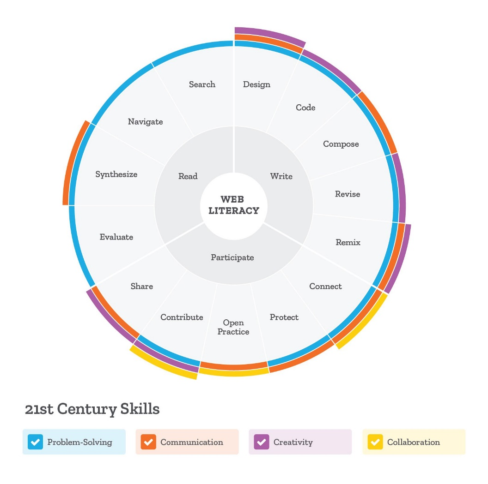
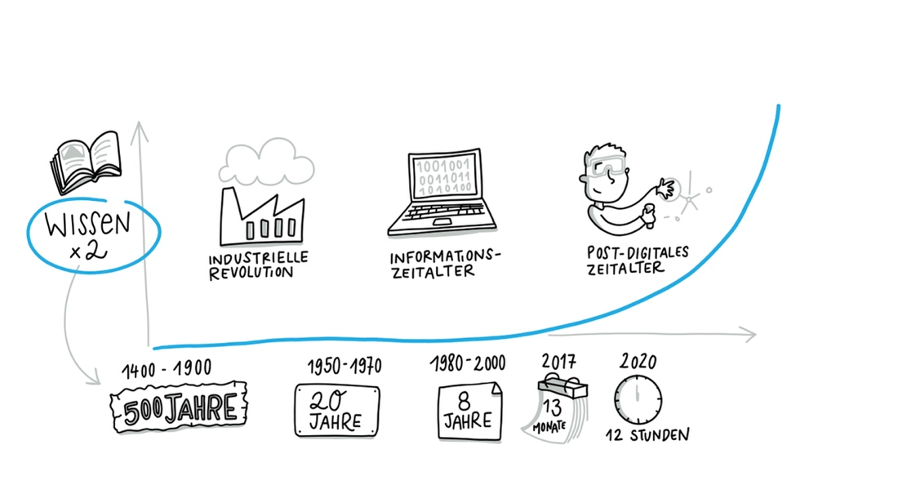
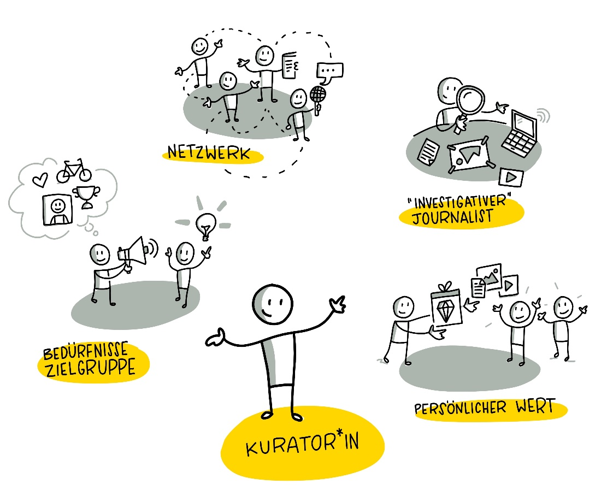
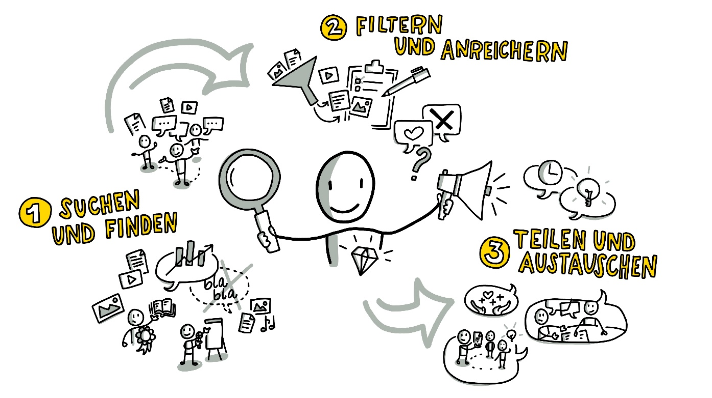

**Content Curation lernOS Circle Guide**

***A guide to how you can find, make sense of, and share relevant content***.

Have no idea what content curation (or also called "digital content curation") is and would like to get an idea?

Content curation helps you put together valuable information about topics with the help of content and experts, without having to reinvent the wheel. You'll learn methods, forms, and approaches for thinking outside the box about your topic and sharing your emerging knowledge with others.

When you learn about content curation through this lernOS Circle Guide
you will learn about the mechanisms and differences between machine
of machine filters (via algorithms) and human filters.
understand. But you'll also learn to make curation work for you and your life.
to work more openly and visibly and to learn how to deal with the
the flood of available knowledge, help others, save time, and understand things.
and understand things. Along the way you will gain
reputation and expertise, within your organization or in your network.
network. You will learn that networks based on trust are the key to
are the key to getting along in our complex world and to learn quickly and
to learn and innovate quickly and effectively.

If you want to learn more details to decide if the
Content Curation guide is right for you, listen to Stefan\`s
podcast on content curation -- it will definitely help you to get some
insights into the topic and help you decide if you want to spend the next
more intensively with content curation over the next 13 weeks.
content curation.

[The podcast](https://podcast.opensap.info/education-newscast/2020/02/10/education-newscast-073-learntec-content-kuratierung-mit-stefan-diepolder/) with Christoph Haffner and Thomas Jenewein from the
SAP Education Newscast on content curation in the context of the Learntec trade fair
2020 - the episode lasts about 52 minutes -
(accessed on 13.10.2020)

 

**Basics**

If you are thinking about doing this Circle, you should have a look at the following
take a look at the following basics that we have put together for you.
we have put together for you.

- What is curation?

- How can you define curation?

- Why should you curate?**

- What distinguishes curators?

- How does curating work?**

**What is curating?**
You can get a first insight by watching the video that Stefan showed at a
a meetup of the Colearn Community Munich #clc089:\
["Content Curation" from Stefan Diepolder meeting the
https://youtu.be/rn_AQuUxxIk

 

 

 

**How to define curate?**

 Origin of the word "curate"
[in Langenscheidt Lexicon], https://de.langenscheidt.com/latein-deutsch/curare, accessed on
16.06.2020)

Latin "curare" means, among other things.

\...to take care of....

\...to care\...

\...to take the trouble\...

\...to have desire\....

There is no universal definition of content curation, but for us this short
but for us this short summary, based on Robin Good, defines very well what it is
what it is all about:

 

> **"Content curation is the art of finding, filtering, organizing, and delivering value to digital
> artifacts on a particular topic for a specific audience interest, filtering, organizing, adding value
> added and made publicly accessible. "**

Robin Good: [What is Content Curation?](https://medium.com/content-curation-official-guide/what-is-content-curation-84212256e84)
(accessed on 16.06.2020)

>  

Curation is not just the idea of a few internet-savvy geeks.
Even if they are often not called that, the skills of curators belong to the
curatorial skills are among the core competencies of the 21st century.
also the [Mozilla
Foundation](https://foundation.mozilla.org/en/initiatives/web-literacy/)
has worked out.

 

Partial competencies of curation such as share, compose, remix, evaluate,
synthesize, search, connect, contribute are among the 21st Century
Skills promoted by the Mozilla Foundation in the area of Web Literacy. If you go to the pages, you can go through curated learning paths on each skill.

Figure: <https://foundation.mozilla.org/en/initiatives/web-literacy/>
(CC BY 4.0)

 

**Why curate?**

Our problem today is not the lack of information as it used to be,
but the lack of reliable and efficient filters. Professor
Clay Shirky puts it very clearly.

***"It\`s not information overload. It\`s filter failure."***

Quelle: Clay Shirky. AZQuotes.com, [Wind and Fly LTD], 2020.
https://www.azquotes.com/quote/409865, accessed on 18.06.2020.  

He explains the [Information Overload](https://youtu.be/XE38jpFOiv8) in 3
minutes on Youtube.

The world we live in today is characterized by abundance. To
to cope with abundance, effective filters are necessary. No matter
everywhere we look, the first decisions are taken from us, whether we like it or not.
taken away from us, whether we like it or not. Our Google home page, the
access to the world's largest library, knows and remembers our
preferences and our search history -- and suggests to us, optimized and filtered by algorithms
algorithms to suggest what should interest us most in our search.
should be of most interest to us in our search.

If you want to go a little deeper - the [Video "Beware of the Online
Filter Bubbles"](https://youtu.be/B8ofWFx525s) by Eli Pariser
describes how this mechanism works (09:05 minutes)

We go to a supermarket -- and find the products at
eye level that the supermarket owner thinks we should buy --
and not the products we actually want, such as
particularly low-priced or sustainable, regionally produced
products. And, and, and.... Let's be aware - we live in a
world that is characterized by abundance and filtered and curated for us.
curated for us - and in which many decisions and opportunities are already anticipated by
technical systems or people are anticipated.

Music is a good example here, especially also for the
diversity and abundance in today's world: As recently as the 17th century, music was something very special.
Century, music was something very special. It could only be enjoyed live
and only a very few rich and famous people had access to it.
people. Then, starting in the 19th century, technical devices were invented,
music was made replayable, from the first gramophones, record
gramophones, record players, cassette and CD players to the invention of the mp3
invention of the mp3 format and thus the digitization of music.
In the meantime, everyone can have their personal music with them on their smartphone anytime
and everywhere, often aggregated by powerful portals like
YouTube, Spotify or iTunes. We can find all kinds of music styles from
from every corner of the world, and very quickly we are overwhelmed by the abundance of
overwhelmed with the abundance of possibilities. To counter this, the music portals use recommendations
recommendations calculated by algorithms, enable the exchange of information
and recommendations among friends, for example, also provide their own,
filtered offers and playlists.

 

And when it comes to knowledge, information and content, it's even more
more extreme, because knowledge grows exponentially. As the figure below
shows, knowledge doubled every 13 months in 2017, with the trend
in the direction of "much faster." Contributing to this, for example, are
simple systems and devices that are easy and quick for everyone to
and can be shared many times over in a flash via portals and social media.
and shared via portals and social media. Keeping a good overview, separating the
separating the wheat from the chaff is more important than ever.

 

Visualization by Katrin Mäntele
[\@kleinerw4hnsinn](https://twitter.com/kleinerw4hnsinn) (CC BY)

 

Quelle: Knowledge Doubling Curve,:
<https://www.valamis.com/blog/why-do-we-spend-all-that-time-searching-for-information-at-work>,
accessed on 17.06.2020

 

We are therefore heavily dependent on curation and, especially in the
digital world, it constantly surrounds and influences us, often without our
that we are consciously aware of it. That's why we think it's important to
with curation and its mechanisms.

**What characterizes a curator?**

Curators create and design a space, arrange the artifacts they have selected and filtered artifacts and give them a new, individual value. a new, individual value. Like, for example, a curator in an art exhibition. art exhibition. A content curator learns by himself/herself incredibly quickly and efficiently by intensively dealing with topics topics, immersing himself/herself, filtering and organizing, curating
curating. Especially the process of enrichment or sensemaking, in which one deals intensively with the collected contents, validates them validating it, questioning it, and creating something new from it, such as a blog post, a podcast, or a video from it, initiates an efficient and intensive and intensive learning process and helps to make good and well-founded decisions. to be able to make.

 

Good curators know their audience and their needs and interests. They are very well connected, both with their target group (the so-called "tribe") and with knowledge carriers and thought leaders relevant to their topic.
thought leaders who are relevant to \"their" topic. They think and work like investigative journalists, who work diligently and meticulously to find, filter and collect the best content nuggets.
collect. They take care of their audience by providing them with their best sources and adding personal value to them, giving their audience a reason to engage with the content or topic.

Visualisierung von Katrin Mäntele
[\@kleinerw4hnsinn](https://twitter.com/kleinerw4hnsinn) (CC BY)

 

**How does curation work?**

Content curation, as it is used in many fields today, has emerged from the overabundance of information, some of which is difficult to assess and relate. It reflects the need to find relevant information, to filter it, to record it, to check it for facts and truthfulness, and then to enrich it and create points of connection to existing knowledge.

 

One possible approach to these steps is a three-step process according to Harold Jarche (2014) (<https://jarche.com/2014/02/the-seek-sense-share-framework/>), which can be

1. deals with **searching or finding** content, information and

> experts,

2. dem **Filtern und Organisieren** und im weiteren, wichtigen Schritt

   > dann **Anreichern** dieser Inhalte mit **Wert und Meinungen**,

3. und schließlich den Möglichkeiten des **Teilens und Austauschens**.

{width="6.33333552055993in"
height="3.5520833333333335in"}Visualisierung von Katrin Mäntele
[\@kleinerw4hnsinn](https://twitter.com/kleinerw4hnsinn) (CC BY)

 *Kompetenz um die Kurator\*innen einzuschätzen (Werte) - Werte sollten
klar sein*

1. **Suchen bzw. Finden**\

   > Es geht darum, interessante und relevante Informationen zu finden
   > und auf dem Laufenden zu bleiben. Unter all dem „Lärm" die
   > wirklich hilfreichen, lesens- und lernenswerten Beiträge vom
   > „Geplapper" zu unterscheiden. Und sich über die Zeit ein Netzwerk
   > von vertrauenswürdigen Quellen und Experten aufzubauen. So dass
   > man nicht nur Informationen sucht, sondern sie auch automatisch
   > über unser Netzwerk ihren Weg zu uns finden. Gute Kuratoren sind
   > immer auch verlässliche Mitglieder in Wissensnetzwerken.\
   >  

2. **Filtern, Organisieren und Anreichern**\

   > Filtern heißt die Spreu vom Weizen trennen, wissen, welchen
   > Quellen und Menschen man vertrauen kann und wie man
   > Wissensbereiche voneinander abgrenzt, um den roten Faden nicht zu
   > verlieren. Im nächsten Schritt muss man für sich eine
   > übersichtliche und zeitsparende Art finden, die Informationen zu
   > speichern, sortieren und schnell auffindbar zu machen.\
   > Dann kann man im wichtigsten Schritt, dem Anreichern von Wert und
   > Nutzen für die Zielgruppe, sinnvoll mit den Inhalten arbeiten und
   > z.B. Zusammenfassungen schreiben, Querverweise herstellen,
   > vergleichen, kritische Fragen stellen usw. Selbst zu kuratieren
   > und aus verschiedenen Bausteinen und Artefakten einen Artikel oder
   > Blogpost zu erstellen, ist eine sehr effektive und wirkungsvolle
   > Methode, selbst zu lernen und Wissen aufzubauen.\
   >  

3. **Teilen & Austauschen**\

   > Hier geht es darum, für sich ein Gespür und eine Praxis zu
   > entwickeln, wie man seine angereicherten Inhalte wann und mit wem
   > teilt, wie man Ideen und Erfahrungen in seinen Netzwerken
   > weitergibt, Feedback einholt, Inspirationen bekommt oder in die
   > Zusammenarbeit mit Kolleg\*innen in der Arbeit geht.

 

**Quellen & weiterführende Links:**

* Zusammenfassung des Meetups zu Content Curation mit Stefan Diepolder:
  <https://colearn.de/clc-muenchen-clc089-content-curation-im-corporate-learning/>
  (abgerufen am 12.04.2020)

* Kuratieren: <https://de.langenscheidt.com/latein-deutsch/curare>,
  abgerufen am 15.04.2020

* Definition Content Curation: Angelehnt an Robin Good [Content Curation
  Official
  Guide](https://medium.com/content-curation-official-guide/what-is-content-curation-84212256e84),
  abgerufen am 13.04.2020

* Mozilla, Web Literacy: <https://learning.mozilla.org/en-US/web-literacy>

* Lesetipp: *\"Curation -- The Power of Selection in a World of Excess\"*
  von Michael Bhaskar. Verbindet Industriegeschichte mit Kuratierung und
  zeigt in vielen anschaulichen Beispielen, in welchen Lebensbereichen wir
  schon mit Kuratierung vertraut sind.

* Digitalisierung der Musikindustrie:
  <https://blog.wiwo.de/look-at-it/2018/10/09/digitalisierung-der-musikindustrie-turnaround-durch-streaming-nach-schwund-um-zwei-drittel/>,
  abgerufen 16.04.2020

* Knowledge Doubling Curve by Buckminster Fuller
  <https://www.valamis.com/blog/why-do-we-spend-all-that-time-searching-for-information-at-work>,
  abgerufen am 18.04.2020

* Good, Robin (2018): What is Content Curation URL:
  <https://medium.com/content-curation-official-guide/what-is-content-curation-84212256e84>,
  abgerufen am 23.03.2020

* Shirky, Clay (2011): It\`s not Information Overload, it\`s Filter
  Failure URL: <https://www.azquotes.com/quote/409865>, abgerufen am
  18.04.2020

* Jarche, Herold (2014): The Seek Sense Share Framework URL:
  <https://jarche.com/2014/02/the-seek-sense-share-framework/>, abgerufen
  am 15.04.2020)

* Janne Hietala, Jens Harju, Samu Kuosmanen (2019): Knowledge Doubling
  Curve by Buckminster Fuller URL:
  <https://www.valamis.com/blog/why-do-we-spend-all-that-time-searching-for-information-at-work>,
  abgerufen am 18.04.2020

* "PKM -- A set of processes, individually constructed, to help each of us
  make sense of our world and work mor effectively

* Zitat aus dem YouTube Video [Personal Knowledge Management Workshop
  Intro 2013](https://youtu.be/HQbnoLxgx7I), abgerufen am 18.06.2020
