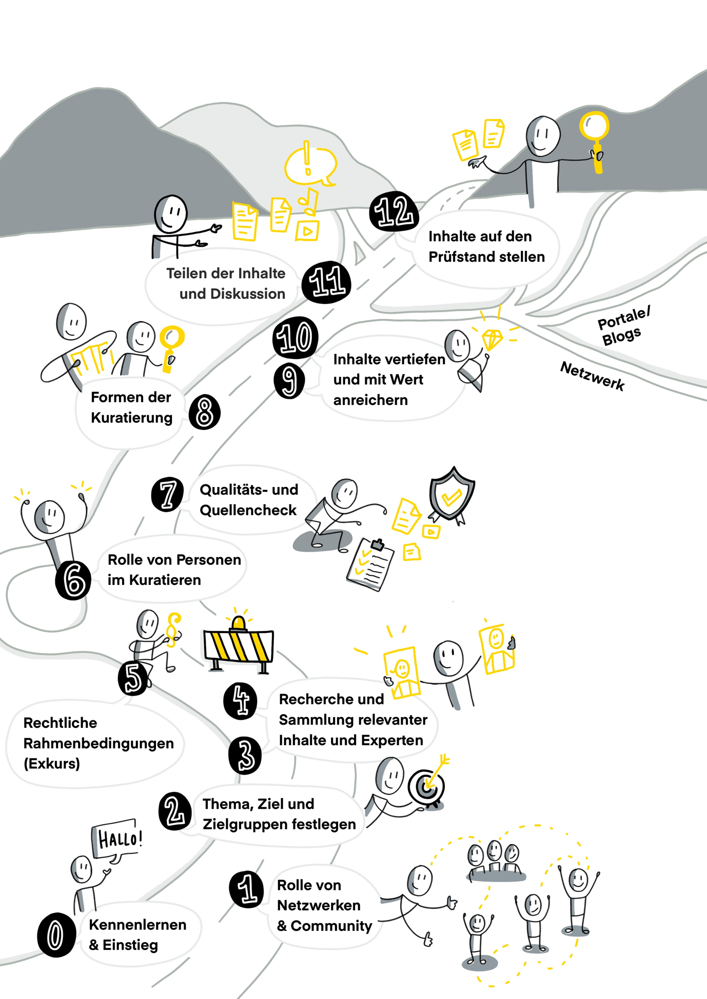

# Lernpfad

**The frame**

- Period: **13 weeks** (plus possibly one week break in the middle)
- Week 0 to get started together or to get a taste of the program
- 12 weeks for exchange & learning about the topics, methods and exercises
- 1 x per week Circle meeting (1 hr.) + self-directed learning & exercises (1-2 hrs.) for beginners
- For those who want to go deeper, or are advanced in the topic, there are deepening katas, time required approx. 2 hrs. per week.
- We recommend to work on the exercises in the course of the week and then in the following week to go into the common exchange about it and to learn from each other.

**The content flow**.
We have tried to put together content and exercises (katas) for this Content Curation Guide that are as practical and build on each other as possible, which are a good balance between theory and practice. For the next 12 or 13 weeks, you will be dealing with the following topics:

- **Getting to know each other** (1 week)
- **Role of networks & communities** (1 week)
- **Determining topic, goal and target groups** (1 week)
- **Research and collection of relevant content and experts** (2 weeks)
- **Legal framework** (1 week)
- **Role of people in curation** (1 week)
- **Quality and source check** (1 week)
- **Forms of curation** (1 week)
- **Enriching content with depth and value** (2 weeks)
- **Sharing content and discussion** (1 week)
- **Putting content to the test** (1 week)

 Visualization by Katrin Mäntele [@kleinerw4hnsinn](https://twitter.com/kleinerw4hnsinn) (CC BY)
