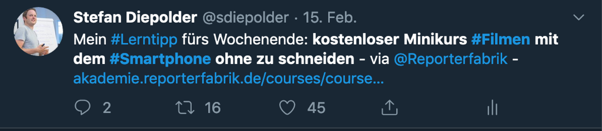

## Woche 9 und 10 - Inhalte vertiefen und mit Wert anreichern

 In diesen zwei Wochen geht es um den Kern des Kuratierens, es geht
 darum, Inhalte zu arrangieren, redigieren, neu anordnen, bewerten, in
 einen Kontext bringen und mit Wert anreichern. Alles, was bis hierher
 passiert ist, waren sozusagen die \"Vorarbeiten\". Jetzt geht es
 darum, Contents noch einmal genau zu analysieren, überflüssige und
 veraltete Informationen herauszufiltern, Inhalte zu ordnen und sie mit
 einem Nutzen zu versehen (Sensemaking). Das ist das Herz von Content
 Curation und kann nicht von Algorithmen übernommen werden. Algorithmen
 können nur filtern.

 Überlege Dir, wie viel Arbeit Du Dir machen willst und wie Du Wert für
 Deine Zielgruppe schaffen kannst. Beachte, dass es unterschiedliche
 tiefe Level des Sensemaking (Wert hinzufügen) gibt, von denen wir 3
 hier kurz vorstellen möchten:

-   **Begründete Empfehlungen von Inhalten und Experten**

 Gib Deinem Publikum bzw. deinem Tribe einen Grund bzw. einen Tipp,
 warum sie wertvolle Zeit und Energie auf Deine empfohlenen Inhalte
 verwenden sollen. 

  

 Beispiel: 

 https://twitter.com/sdiepolder/status/1096449666504445952 

 Diese Art von Kuratierung ist völlig ausreichend, wenn Deine
 Zielgruppe auf Social Media anzutreffen ist und Du z.B. einen guten
 Artikel oder ein Video gründlich studiert hast, das Du unbedingt
 empfehlen möchtest.

  

-   **Erstellung eines eigenen Contents mit kuratierten Inhalten**\
     Dieses nächste Level geht tiefer, sowohl inhaltlich als auch vom
     Aufwand. Hier verfasst Du z.B. einen Blogpost, einen Artikel,
     stellst eine Präsentation zusammen, zeichnest eine Sketchnote,
     Mindmap oder nimmst ein Video auf. Sei kreativ!

 Immer wenn Du tiefer in Dein Thema eintauchen möchtest, eine Art
 Landing Page erstellen oder ausführlich über Dein Thema diskutieren
 möchtest, bieten sich die o.g. Formate hervorragend an, Deinen
 Inhalten Nutzen hinzuzufügen. Und natürlich
 [ePortfolios](https://cogneon.github.io/lernos-eportfolio/de/) in
 jeglicher Art (siehe auch den benachbarten Circle-Leitfaden zum
 \"ePortfolio-Learning\").

 Hier wieder ein paar gute Beispiele:

-   Content Curation Podcast von Stefan mit den Kollegen Christoph
    Haffner und Thomas Jenewein vom SAP Educast -
    <https://open.sap.com/static/education-newscast/?name=2020-02-07_educationnewscast073.mp3 -
    Wichtig ist dabei auch das Zusammenspiel von Audio und Shownotes.

-   Eine hilfreiche Sketchnote zum Thema \"Leading and Learning\" von
    Tanmay Vora
    <http://qaspire.com/2015/01/23/3-cs-for-learning-and-leading-on-social-media/

-   Ein optisch und inhaltlich besonders "wertvoller" Blogpost von Maria
    Popova zu Kritischem Denken nach dem Klassiker \"Baloney detection
    Kit\" von Carl Sagan
    [https://www.brainpickings.org/2014/01/03/baloney-detection-kit-carl-sagan/\
    ](https://www.brainpickings.org/2014/01/03/baloney-detection-kit-carl-sagan/)

-   **Erstellung und Pflege eines Portals, eines Knotenpunktes für Dein
     Thema**\
     Du kuratierst und publizierst regelmäßig über Dein spezielles
     Thema, in dem Du ein ausgewiesener Experte bist. Du machst Deine
     Erkenntnisse öffentlich und fasst sie zu einem attraktiven,
     relevanten Portal zusammen. Ein Beispiel hierfür ist der
     [\"Content Curation - Official
     Guide\"](https://medium.com/content-curation-official-guide) von
     Robin Good, erstellt im Blogportal Medium.

**Woche 9**

**Kata 15:**

Überlege Dir, wieviel Zeit Du aufwenden kannst und willst, um Dein Thema
zu kuratieren. Willst Du eher Inhalte anderer empfehlen und bekannt
machen oder selbst Content erstellen und Deine eigene Sicht der Dinge
darstellen? Macht es Sinn, einen eigenen Blog oder ePortfolio
aufzusetzen oder schreibst Du Deine Artikel in einem Portal wie z.B.
Linkedin oder Medium? Was sind jeweils die Vor- und Nachteile?

Diskutiert in Eurer lernOS Gruppe, welche Art der Kuratierung zu Euren
Themen passen.

  

**Kata 16:**\
Du hast mittlerweile viele gute Quellen für Dein Thema gesammelt und
diese gelesen und abgelegt. Jetzt ist es an der Zeit, sich noch etwas
intensiver mit den Inhalten auseinanderzusetzen und selbst etwas eigenes
Neues zu kreieren.

Nimm Dir den Inhalt vor, den Du als Basis für Deine Kuratierung
identifiziert hast und analysiere ihn ganz genau. Falls Du ein Video
verwendest, halte es z.B. jedes Mal an, wenn Du eine interessante
Aussage gehört hast und mach Dir Notizen. Wenn das Video interessant
visualisiert ist, schieße Screenshots und beschrifte diese mit eigenen
Assoziationen. Arbeite den Inhalt konsequent durch.

-   Hast Du neue Erkenntnisse gewonnen? Was ist die Kernaussage des
     Inhalts? Haben sich Fragen ergeben, die Du beantworten würdest?
     Schreibe Dir Fragen und Antworten auf und beginne damit, Deinen
     Inhalt zu erstellen -- den Blogpost zu verfassen, Deine Sketchnote
     zu zeichnen\... welches Medium Du auch immer gestalten möchtest.

-   Stelle Dein Basismedium im lernOS Circle vor und begründe Deinen
     eigenen Standpunkt. Bleiben Fragen offen? Kannst Du diese Fragen
     schon beantworten oder macht es Sinn, weitere Inhalte zu suchen?
     Nimm die Anregungen Deiner Kolleg\*innen auf und nutze sie für
     Deine Kuratierung.
