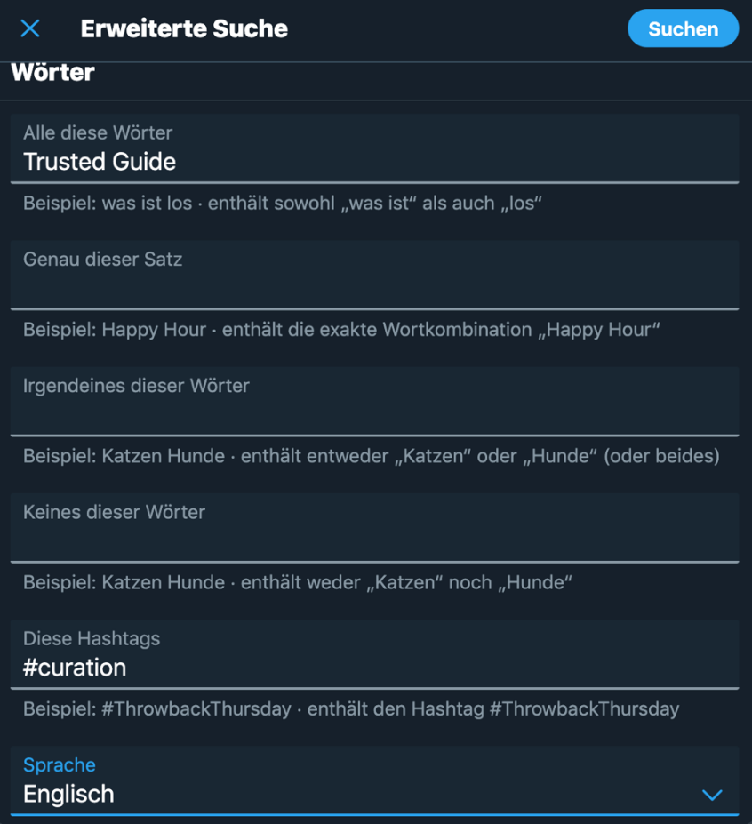

## Week 3 + 4: Research and collection of relevant content and experts

Who do you ask when you want to get good and relevant information quickly? What do you do intuitively? If you need help solving a problem at work and know an expert who is happy to take time and share knowledge, you go directly to that person. Or if you want to introduce a new tool or process and you know people in other companies who have already done it, you will ask them directly. And if you are planning a major purchase in your private life, such as a car or a house, you will inform yourself in detail over a longer period of time, talk to many people and listen to the advice of those who are visibly good with money and have already achieved your goals. have already achieved their goals.

 What they all have in common is that you know these people, you know what they stand for and they are role models for you in this particular area. They are trustworthy experts. You have built up a relationship of trust with them and accept their recommendations.

 How can this mechanism be transferred to curating?

 **Kata 5:**
 Write down 3 topics that occupy you the most at the moment and write down 2 names behind each that you really trust. Link the content, articles, videos and podcasts (...) and possibly also books that you know, have read, watched or studied and listened to with your personal comments. Make yourself a list - ideally they are people you have already met personally - or whom you have been following intensively for a long time and know exactly how they think and what they stand for. They are your "trusted guides". 

 ***Excursus:***
*If you are looking for a tool that allows you to quickly incorporate information from the Internet and is easy to use, we would recommend Microsoft OneNote. OneNote is available both for free (up to max. 5 GB) via a live.com account ([here](https://outlook.live.com/owa/) you can sign up if you don't have an account yet) or via a paid [Office 365](https://www.office.com/) account, which provides much more functionality.*

 *If you want to try OneNote for the first time and have no idea what to do with it, [this blogpost](https://colearn.de/corporate-learning-community-region-frankfurt-clc069-2-treffen-am-5-maerz-2018/) will help you.*

 **Kata 6:**
 Now, in the second step, find the sources that your trusted guides particularly like to use to publish their content. This could be their Twitter channel, their personal blog or even a web portal or a YouTube or podcasting channel. Now search these sources for relevant information, ideas or even references to other people on your topic. Use, for example, the function of Google, with which you can search a website specifically.

 

 Example: Google search on the site of Harold Jarche (\"site:jarche.com\") on Fake News

 **Professional tip for Twitter users**

 Anyone who wants to approach a new topic and does not yet know any experts on it usually starts with research via a web search engine - and this is usually Google. This is a tedious way and often does not lead to the best results - because there are simply far too many pages listed on Google and you won't find any clues as to which pages are really relevant and which are not.

 We therefore recommend researching via Twitter, because Twitter links people and content very quickly and effectively, and this is an immense advantage when searching for relevant information.

 Here is an example of the [advanced search](https://twitter.com/search-advanced) of Twitter

 

 **Deepening kata:**
 Seek help from your followers (#followerpower) and ask them directly via Twitter for a recommendation on your new topic or for people who they think can help you. If you have a good network, you will very quickly get very good and relevant information and people recommended.
