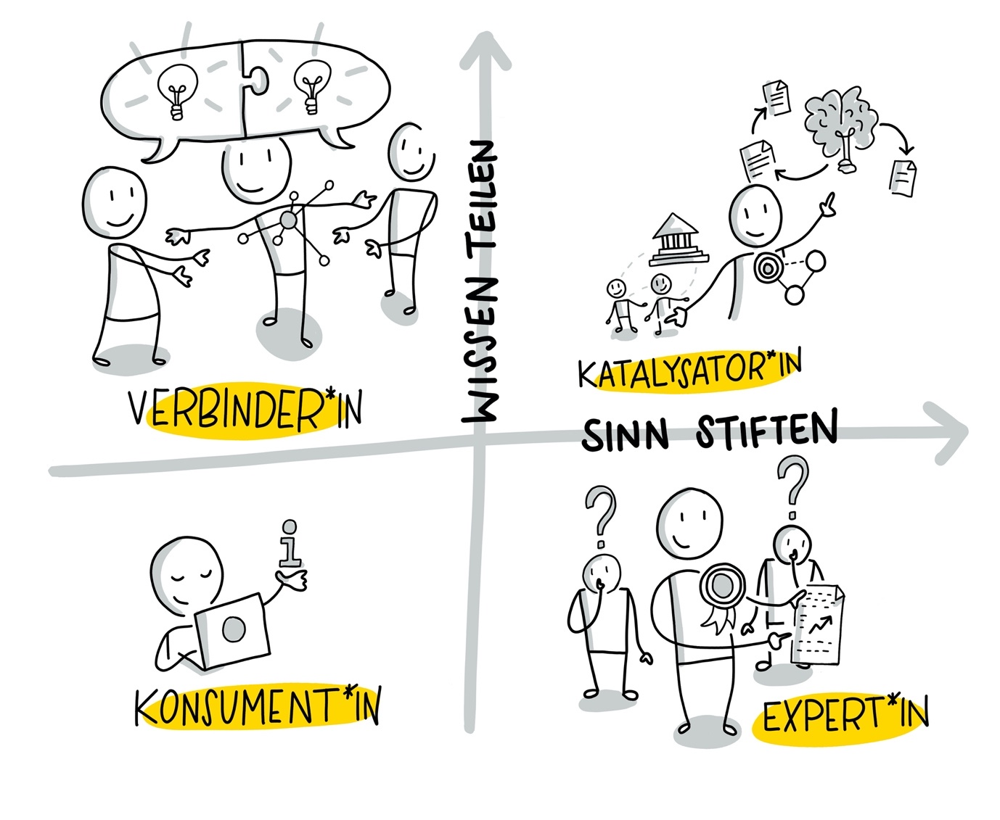

## Woche 6 - Rolle von Personen im Kuratieren

Die Grundlage von Content Curation ist das eigene Netzwerk, die genutzten Ressourcen und wie man sie verbindet. Jedes Netzwerk und jede Community lebt von und mit den Menschen, die darin ihren Beitrag leisten. Die unterschiedlichen Rollen, die Menschen in Netzwerken spielen, kann man in Konsument*innen, Expert*innen, Verbinder*innen und Katalysator*innen unterscheiden (vgl. Harold Jarche, <https://jarche.com/; <https://jarche.com/2017/05/the-world-needs-knowledge-catalysts/)

 

 Visualisierung von Katrin Mäntele [\@kleinerw4hnsinn](https://twitter.com/kleinerw4hnsinn) (CC BY)

 **Konsumenten*innen**
nutzen ihre Netzwerke, um an Informationen zu kommen. Sie lesen Beiträge, um ihr Wissen zu erweitern, ohne diese zwangsläufig zu
sammeln, anzureichern und zu teilen. Natürlich sind wir alle auch immer Konsument*innen in unseren Netzwerken, besonders wenn wir uns mit einem neuen Thema beschäftigen oder bei Themen, die uns (im Moment) nur am Rande interessieren.

 **Expert*innen**
durchdringen und verstehen ihre Themengebiete im Detail. Sie sind aber nicht zwangsläufig gut darin, ihr Wissen zusammenzufassen und weiterzugeben. Im Kuratieren ist ein*e Expert*in oft einfach jemand, der mehr über ein Thema weiß, als man selbst. Um sich als Expert*in zur Kurator*in weiterzuentwickeln kann man üben, über sein Themenfeld in einfach(er)en Worten zu reden, zu schreiben, es zusammenzufassen und mehr mit anderen zu teilen.

 **Verbinder*innen**
sind gute Netzwerker\*innen, kennen viele Leute, kommen leicht mit allen ins Gespräch und bringen Menschen zusammen. Im Kuratieren tragen sie dazu bei, neue Verbindungen zu sehen und aufzubauen und machen auf interessante Themen, Ansätze und Meinungen aufmerksam. Um sich als Verbinder*in zum*r Kurator*in weiterzuentwickeln, kann man seine Fähigkeiten, Wissen anzureichern und mit einem Mehrwert zu teilen, ausbauen und üben. Darüber hinaus ist es auch wichtig, sich zu überlegen, wann, wo und mit wem man seine Inhalte teilt.

 **Katalysator*innen**
sind gut darin, Wissen anzureichern, Wissensverbindungen sichtbar zu machen und Wissen weiterzugeben, aber auch darin, Menschen, Ideen und Organisationen zu verbinden. Katalysieren in diesem Sinne ist die hohe Kunst im Wissensmanagement und in der Content Curation. Nur wenige Menschen sind gute Katalysator*innen, eine Grundvoraussetzung ist jedenfalls, dass sie gute Kurator*innen sind.

 **Kata 9:**
In den Aufgaben in Woche 1 hast Du Dir bereits Gedanken über Dein Netzwerk gemacht und bestimmt Kontakt mit verschiedenen Expert*innen über die eine oder andere Art aufgenommen. Überlegt Euch jetzt zusammen, wie Ihr in Euren Netzwerken (z.B. Xing/LinkedIn, Twitter) Verbinder*innen erkennen könnt und wodurch das in ihren Beiträgen sichtbar wird? Überlegt in der Gruppe oder allein, was Ihr tun könnt, um bessere Verbinder zu werden. Nehmt Euch zwei bis drei Punkte vor und übt sie die nächsten vier Wochen ein.

 **Kata 10:**
Analysiere Deine Netzwerke -- wer sind die Expert*innen, wer die Verbinder*innen, und kennst Du Katalysator*innen? Welche Aktivitäten zeichnen sie jeweils aus und wie würdest Du diese Aktivitäten den Rollen zuordnen. Mach Dir eine Tabelle oder Übersicht und fasse darin Deine Auswertung zusammen.

 **Kata 11:**
Welche Rolle spielst Du in deinen Netzwerken? Welche Rolle würdest Du gern spielen? Was fehlt Dir, um diese gewünschte Rolle zu spielen?
 

 **Vertiefungs-Kata:**
Wenn Du Zeit und Lust hast, zeichne Dir ein Netzwerk mit den wichtigsten Personen zu Deinem Thema. Arbeite heraus, welche Stärken sie haben und ob und wie sie zueinanderstehen. Überlege, wie Du am besten an die Katalysatoren\*innen herankommst und wie Du sie am besten ansprichst. Beginne, ihre Inhalte zu kuratieren, im Sinne eines "Curate the Curators".
