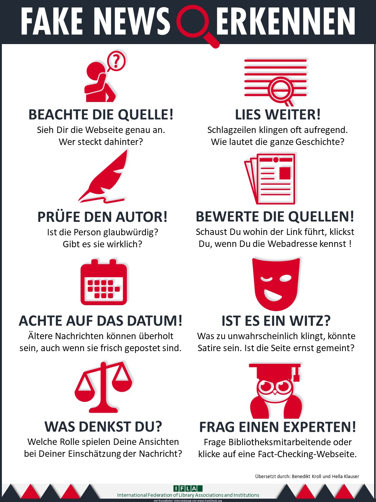

## Week 7 - Quality and source check

From the abundance of sources and information that you have collected on (D)a certain topic, the most important and helpful ones should now be filtered out step by step.

For this purpose we recommend to ask and answer **the following questions**:

- Which are the top 5 (= most important) sources in your recommended order? (Ranking)

- Why would you classify these sources as especially important? (personal evaluation)

- What important insights did you gain for your topic from the source?

- If applicable, are there supplementary, explanatory graphics or learning videos that can further promote understanding and that you can include in the explanation? (3.+4.Learning)

- How would you sort the remaining found sources into areas or which ones can be omitted from your point of view? (Sort out / Selection)

  This step-by-step classification will provide a helpful overview for you and your audience. You can also, for example, create a template with which you go through each source according to the questions and enter the answers.
   

  Now it is important that your sources are truthful and of good quality and that you question them self-critically. To do this, you can, for example, use the criteria that journalists have developed over decades as newsworthiness factors and, of course, also ask other topic experts for help or exchange.

   

  An important competence of a good curator is to recognize and uncover **false reports or fake news**. Today, media companies and influencers earn good money especially when they attract as much attention as possible with their media (e.g., with [clickbaiting](https://de.wikipedia.org/wiki/Clickbaiting)) and serve extreme opinions. This is done primarily by advertising according to the number of clicks placed on the mostly free articles, videos and other media. And the artificial intelligence that automatically recommends what we should consume next is not optimized for objectivity and quality of the media, but to keep the user consuming as long as possible. This is why it is of particular importance to check information and especially sources in order to then proactively form an opinion that is as objective and fact-based as possible. The following diagram from the [International Federation of Library Associations and Institutions](https://www.ifla.org/) provides a good working guide.:

  

**Source:** [https://www.ifla.org/publications/node/11174](https://www.ifla.org/publications/node/11174) - CC BY 4.0

  

 Fake news has been around as long as there has been media. We therefore need to know our options for debunking it, and critical thinking is the key to recognizing it. For those who want to delve deeper into the topic: [ttps://jarche.com/2016/12/understanding-our-tools/](https://jarche.com/2016/12/understanding-our-tools/)

 **Kata 12:**
 Conduct an initial fact check for at least two of your researched sources. A possible guideline for this is the method guide of the [Correctiv](https://correctiv.org/faktencheck/ueber-uns/2018/10/04/unsere-methode) journalist team . Record the results in bullet points and discuss your results together in the next meeting.

 **Deepening kata 1:**
 Arrange an appointment with one of your experts from your network to take a closer look at the Top5 sources with him/her, so that you can make a joint assessment at the end. (approx. 60-90 min.)
  

 **Deepening Kata 2:**
 Two entertaining Youtube videos ([part 1](https://youtu.be/qTKat-O7F7g) and [part 2](https://youtu.be/AlSmcBbT15Y)) on critical thinking based on Carl Sagan's classic "The fine Art of Baloney Detection" by
 [maiLab](https://www.youtube.com/channel/UCyHDQ5C6z1NDmJ4g6SerW8g/about),
 Mai Thi Nguyen-Kim.

 You can find a recommendable online course of the Correctiv editorial staff for further education here: [Wokshop Reporterfabrik](https://akademie.reporterfabrik.de/courses/course-v1:Reporterfabrik+Workshop223+2018/course/)
