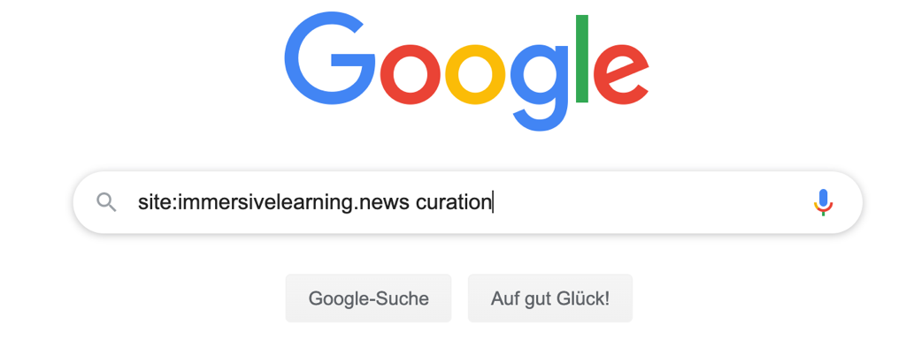
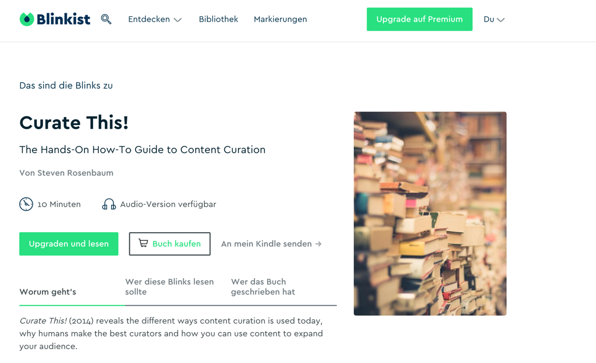
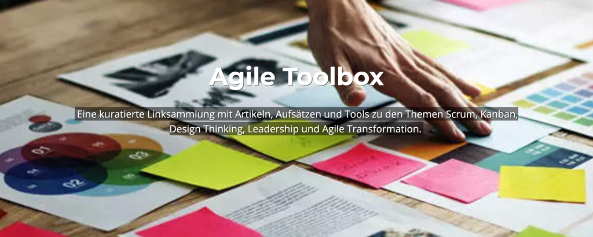

## Week 8 - Forms of curation

There are many different ways to present the curated result ("sensemaking"). Robin Good has collected and described a comprehensive list of approaches and formats with many exciting examples in his article ["Content Curation Approaches: Types and Formats"](https://medium.com/ccontent-curation-official-guide/content-curation-approaches-types-and-formats-ae2b33fe6a18). You should definitely read this article before you start thinking about which format to use.

All types and formats have one thing in common - ***"finding and organizing existing content artifacts to create new insights and shared value "*** ([Robin Good](https://medium.com/content-curation-official-guide/content-curation-approaches-types-and-formats-ae2b33fe6a18%20)).

  

 

Visualization by Katrin Mäntele [@kleinerw4hnsinn](https://twitter.com/kleinerw4hnsinn) (CC BY)

 We find the following formats or types of curation based on Robin Good's ideas most relevant for a learning context. We recommend that you choose formats that you feel comfortable with (e.g. \"I like to write\" -\ blog).

  

 **Aggregate**
 Aggregating content describes the work when the curator collects, describes, and provides high-quality content or artifacts in a central location for their audience. These aggregated contents are particularly valuable when they are provided by a recognized expert, a so-called **"Trusted Guide "**.

  

 A very good example is [https://www.immersivelearning.news/](https://www.immersivelearning.news/) by Torsten Fell - a portal that provides all relevant information on learning with augmented reality, virtual reality and mixed reality and is definitely a very good starting point for a "deep dive" into the topic.

  

 

 Screenshot landing page portal [Immersive Learning News](https://www.immersivelearning.news/) from Torsten Fell

  

 **Pro tip**: If you are looking for a specific topic and have found a reliable source, use Google Page Search to quickly get to the information you need.
  

 

  

  

 **Linking**
 Synthesizing is classically about summarizing long, elaborate media and content into short, crisp nuggets that nevertheless reflect the essence of the medium/content. The selection of the media is also an achievement of the curators.

 Classic examples are (paid) services like [www.getabstract.com](http://www.getabstract.com/) or [www.blinkist.com](http://www.blinkist.com/) that summarize books, videos, and podcasts and present them as written text, audio, or sketchnotes.

 

 Example: book summary at [www.blinkist.com](http://www.blinkist.com/)

 What these diverse and in-depth portals have in common is that the individual content is usually very well and accurately summarized, but you still have to search for the "right" content. But which content should be interesting for you and your interests and needs, these portals can hardly say - they act here as content aggregators, which give a rough orientation by topic clusters and recommendations by algorithm - real recommendations or orientation by trusted guides you do not get.

 One of our favorite blogs, [www.weiterbildungsblog.de](http://www.weiterbildungsblog.de/), we would also categorize as "synthesizing," as Dr. Jochen Robes adds value to each article he carefully filters and publishes for his HR and Digital Learning Tribes with a brief personal assessment or summary, giving us readers
 a hint as to whether we should delve deeper into the content he curates. He also does a lot of the work for us by scouting trends and ideas around the world, tagging them and distributing them once a week in his newsletter.

 ![CLC Munich #CLC089: Content Curation in Corporate Learning By Jochen Robes, March 202019 The Internet offers us a wealth of information. But how do we find the ones that are relevant for us or for others? The keyword is content curation, i.e. the systematic retrieval, preparation and publication of information. Stefan Diepolder talked about this in Munich. The focus was on the importance of the topic, its implications, the useful red thread of Harold Jarche ("Seek \ Sense \ Share\") and the question of how HR developers, companies and each individual knowledge worker can benefit from it. Even though the topic is not high on any corporate learning agenda: it is almost surprising that we have not yet heard of any company and its explicit content curation strategy \.... kristinauth, Corporate Learning Community, March 17, 2019 Image Source: CLC Munich](./images/image16.png)

 Screenshot:
 [#clc089 Meetup Content Curation](https://weiterbildungsblog.de/blog/2019/03/20/clc-muenchen-clc089-content-curation-im-corporate-learning/)

  

 **Linking**
 In mapping, curators collect and organize all the important elements that describe a specific area and define the relationship between the components.

 The example of the [MOOC platform Coursera](https://www.edukatico.org/de/report/coursera-groesste-globale-mooc-plattform-und-hunderttausende-lernende-aus-deutschland) shows that it is also possible to organize over 40 million learners and over 1000 courses from over 150 universities. In order to provide a good user experience, the different data must be stored in a
 be stored with a very good structure and linked intelligently. Coursera succeeds in this from our point of view: you can narrow down your search very well and still have the feeling that the platform is small, well maintained and clear. This is evidence of very good curatorial work.

  

 ![Search v What do you want to learn? Level For Business Developers Sign Up Free Participation Search \ Personal Development Personal Development o Filter by: Competencies Job Title Language v Type Most Popular Certificates Business Too UCI Practical Man ement Career Success University of California, Irvine UCI Academic English: Writing University of California, Irvine Arizona State University TESOL Arizona State University CERTIFICATE ABOVE Learning How to Learn Learning How to Learn: Powerful mental tools to help yo\... McMaster University](./images/image17.png)

 [Screenshot Coursera](https://www.coursera.org/browse/personal-development)

  

 **Distill**
 This form of curation ensures that the most relevant information on a specific topic is briefly described and
 simplified into an order. Typical of this are "best-of" lists that provide additional value in addition to a link. A good example of distilling is Jane Hart's listing of [300 Best Learning Tools](https://www.toptools4learning.com/).

 

 **Create learning paths**
 Learning paths are particularly valuable when they are not provided as narrowly as in traditional blended learning environments but rather as a kind of guardrail for our own self-directed development.

 We can apply what we learn in our own way in our work - or not.

 

 Very interesting are e.g. annotated link lists of absolute specialists to whom we attribute the necessary expertise, skills and credibility, such as Christian Müller from [www.proagile.de].(http://www.proagile.de/).

 He manages to provide a hub on the topic of Agile with his "Agile Toolbox", which gives orientation to beginners and professionals in the field of Agile alike and shows a way to deal with relevant topics and content. The content is valuable because it is recommended by him, the Trusted Guide and expert on Agile. We can experience Christian via Youtube, Twitter but also in various barcamps and workshops, as he works out loud (Working out loud) and lets us share his knowledge and ideas.

 

 [Screenshot Agile Toolbox](https://proagile.de/toolbox/)

  

 **Explore**
 This is journalistic work with in-depth research and analysis, using a variety of sources and allowing for opposing opinions and viewpoints. The goal is to give the target audience the opportunity to form their own opinions and to foster a deep understanding of a specific topic, story or problem by presenting contexts in an understandable way and giving the opportunity to dive deeper into
 details and differing views.

 Vivid examples of "exploring" are in-depth blogposts with many opportunities to link further. For example, the following post was written by Stefan for the Corporate Learning Community blog. His intention was to explore the topic of blockchain in depth himself. In doing so, he enriched already collected media, such as the two embedded videos that were relevant to him, with texts and abstracts from blockchain specialists. It was important to him to create as low-threshold an entry point as possible for his target audience, HR specialists from the corporate learning community. Here is an example for orientation:

 ![Topics of the Corporate Learning Camp: Blockchain - Will HR and Corporate Learning use the Blockchain for their own purposes in the future? Or is blockchain replacing HR? September 2018 Charlotte Venema '2 comments Thoughts on a disruptive technology that could turn school, corporate learning and HR upside down by Stefan Diepolder What is blockchain? First of all, Blockchain is a buzzword that many are now using, but few can explain in a simple and understandable way. Among other things, the Blockchain is the system that enables the secure transaction and storage of Bitcoins. But what exactly is the blockchain and how does it work? The following video from CommonCraft explains in simple terms how the blockchain basically works. Blockchain Explained b Common:Craft](./images/image19.png)

 [Link to Blogpost](https://colearn.de/themen-des-corporate-learning-camps-blockchain-nutzen-hr-und-corporate-learning-die-blockchain-zukuenftig-fuer-ihre-zwecke-oder-ersetzt-die/)

  

 Another helpful example of a curated blog post by Maria Popova - [Blogpost "Fixed vs. Groth: The Two Basic Mindsets That Shape Our Lives"](https://www.themarginalian.org/2014/01/29/carol-dweck-mindset/)

   

 **Kata 13:**
 Pick out the most interesting content from your pool of material and try to find out whether it can be assigned to one of the formats. Find out and describe in the group why you think the chosen format is particularly suitable (or not). (20 minutes)

 **Kata 14:**
 Find out YOUR format. Think about what your preference is, what you enjoy, and what format will take you little effort to create in the first step. Draw yourself a mockup, a sketchnote or create a mindmap and imagine what your curated medium could look like. Present your ideas to the other Circle members and discuss them together. (40 minutes)

 **Vertiefungs-Kata:**
 Try to look at your topic from multiple points of view, e.g. pro/con. Try to challenge your hypothesis that you want to prove with curated content (e.g. content curation is a waste of time). Find the right format for it and outline your idea.
